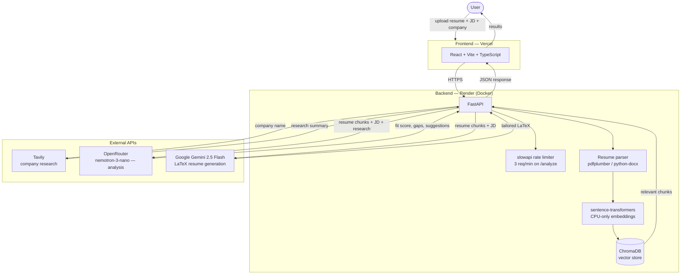

# Akasha

**Resume intelligence, not just resume formatting.**

Upload a resume, paste a job description, name the company — Akasha returns a fit score, a gap analysis, concrete improvement suggestions, and a tailored LaTeX resume ready to paste into Overleaf.

🔗 **Live app:** [akasha-ochre.vercel.app](https://akasha-ochre.vercel.app)
🔗 **API:** [akasha-or1j.onrender.com](https://akasha-or1j.onrender.com)

> Built and deployed at zero cost, end to end — free-tier hosting, free-tier APIs, no paid infrastructure anywhere in the stack.

---

## What it does

1. You upload a resume (PDF or DOCX) and paste in a job description + company name.
2. Akasha chunks and embeds your resume, retrieves the most relevant pieces, and researches the company via live web search.
3. An LLM analyzes the match: a fit score, specific gaps between your resume and the JD, and actionable suggestions.
4. A second LLM call generates a tailored LaTeX version of your resume, optimized for that specific role — copy it straight into Overleaf and compile.

No accounts, no payment, no resume database. You upload, you get results, that's it.

---

## Architecture



**Flow summary:** the frontend never talks to ChromaDB, Tavily, or any LLM directly — every external call is brokered through the FastAPI backend, which is the only thing holding API keys.

---

## Tech stack

| Layer | Technology |
|---|---|
| Frontend | React, Vite, TypeScript |
| Backend | FastAPI (Python) |
| Vector store | ChromaDB |
| Embeddings | sentence-transformers (CPU-only) |
| Company research | Tavily API |
| Analysis LLM | OpenRouter — `nvidia/nemotron-3-nano-30b-a3b:free` |
| Resume generation LLM | Google Gemini 2.5 Flash |
| Rate limiting | slowapi (per-IP) |
| Containerization | Docker |
| Backend hosting | Render (free tier) |
| Frontend hosting | Vercel |

---

## Project structure

```
Akasha/
├── backend/
│   ├── api/            # Routes: /health, /analyze, /generate-resume
│   ├── services/        # RAG pipeline, web search, LLM calls
│   ├── db/               # ChromaDB vector store logic
│   ├── core/            # Config, file validation, rate limiter
│   ├── main.py
│   ├── requirements.txt
│   └── Dockerfile
├── frontend/
│   ├── src/
│   │   ├── components/   # UI components (Hero, UploadForm, ResultsPanel, etc.)
│   │   └── api.ts        # Backend API client
│   └── public/
├── docker-compose.yml
└── .env.example
```

---

## Running it locally

### Prerequisites

- Python 3.11+
- Node.js 18+
- Docker (optional, for containerized backend)
- API keys: [Tavily](https://tavily.com), [OpenRouter](https://openrouter.ai), [Google Gemini](https://ai.google.dev)

### 1. Clone and configure

```bash
git clone https://github.com/Sithi-Vignesh/Akasha.git
cd Akasha
cp .env.example .env
```

Fill in `.env` at the project root with your API keys:

```
TAVILY_API_KEY=your_key_here
OPENROUTER_API_KEY=your_key_here
GEMINI_API_KEY=your_key_here
ALLOWED_ORIGINS=http://localhost:5173,http://localhost:3000
```

### 2. Backend

```bash
python -m venv venv
.\venv\Scripts\Activate.ps1   # Windows PowerShell
# source venv/bin/activate    # macOS/Linux

cd backend
pip install -r requirements.txt
uvicorn main:app --reload
```

Backend runs at `http://127.0.0.1:8000`. Swagger docs at `http://127.0.0.1:8000/docs`.

**Or via Docker:**

```bash
cd backend
docker build -t akasha-backend .
docker run --env-file ../.env -p 8000:8000 akasha-backend
```

### 3. Frontend

```bash
cd frontend
npm install
npm run dev
```

Frontend runs at `http://localhost:3000` and talks to `localhost:8000` by default. To point it at a different backend, set `VITE_API_BASE_URL` in a `frontend/.env` file.

---

## API endpoints

All routes are prefixed with `/api`.

| Method | Endpoint | Description |
|---|---|---|
| `GET` | `/api/health` | Health check (used for cold-start polling) |
| `POST` | `/api/analyze` | Upload resume + JD + company → fit score, gaps, suggestions |
| `POST` | `/api/generate-resume` | Generate tailored LaTeX resume |

`/analyze` is rate-limited to 3 requests/minute per IP.

---

## Known limitations & roadmap

Akasha is feature-complete for V1 and built under a strict zero-cost constraint, which shapes a few tradeoffs:

- **Cold starts:** the backend is on Render's free tier, so the first request after idle can take up to ~60s to spin up. The frontend polls `/health` and shows a "waking up" state to handle this gracefully.
- **No daily quota limiter:** Tavily usage is monitored via a dashboard alert at 50% of the monthly free quota rather than enforced in code (in-memory counters don't survive Render's free-tier idle spin-down).
- **Single-document RAG:** built for one resume at a time; no multi-document comparison yet.

**Planned for V2:**
- Caching analysis results between `/analyze` and `/generate-resume` to avoid redundant work
- Multi-document RAG
- ReAct-style agent architecture
- Option to skip straight to resume generation without the full analysis step

---

## License

MIT — see [LICENSE](./LICENSE). Feel free to fork, learn from, or build on this.
